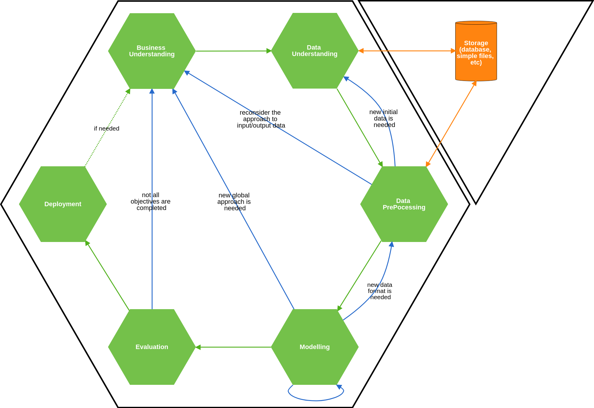

# Data Science Methodology
Just for ...
it is a good starting point.

CRISP-ML, Data Science Project Structure etc

---

## CRISP-ML

*Cross-Industry Standard Process for Machine Learning* ;)

Based on [CRISP-DM (*Cross-Industry Standard Process for Data Mining*)](
https://en.wikipedia.org/wiki/Cross-industry_standard_process_for_data_mining)

### Phases of CRISP-ML
1. **Business Understanding**. Roles: Business Analyst, Data Scientist
    1. **Determine business objectives**. Create List of Objectives 
    2. **Assess situation** It means lookup all resources, assess risks, 
    assess return value, understand requirements, assumptions, constraints
    3. **Determine model's goals** 
    4. **Determine initial data** 
    5. **Produce project plan**. Here should be created projects page with all phases described here. 
    Also, it should be decided: 
        1. which initial models and algorithms should be, 
        2. whether one should use supervised, unsupervised, reinforcement learning  
        3. what will be an input and output data
2. **Data Understanding** (Working with Raw Data). Roles: Business Analyst, Data Engineer, Data Scientist
    1. **Collect initial data**
    2. **Describe data** (use notebooks, text editors etc., use pandas carefully because it is to "heavy"). 
    The result is Initial Data Specification
    3. **Explore data** (use notebooks, text editors etc/, use pandas carefully because it is to "heavy", 
    make visualisation and descriptive statistics)
    4. **Select data from third party sources** (External Data)
    5. **Verify data**
3. **Data Preprocessing** (Raw Data -> Processed Data). Roles: Data Engineer, Data Scientist
    1. **Select Raw Data**
    2. **Clean data**
    3. **Construct data** (Intermediate Data should be produced)
    4. **Integrate data**
    5. **Format data** 
    6. **Save data (in separate file, separate database) or prepare datapipe function**. 
    The result is Processed Data or dataset, 
    which could be separate file or entry in database. 
    In some cases the result of this phase could be a function, 
    which works with database with raw data and returns processed data sample.
4. **Modeling** (this step could be looped). Roles: Data Scientist. As a result of this phase several models should be created
    1. **Select modeling approach**
    2. **Generate test design** (code tests, quality tests, notebooks for visualisation)
    3. **Generate sample generator** (f.e. batch generator)
    4. **Build Candidate Model**
    5. **Assess Candidate Model**
    6. **Choose Final Model**, but keep another 2 best candidates
5. **Evaluation**. Roles: QA, Data Scientist
    1. **Evaluate result**
    2. **Review process**
    3. **Determine next steps**: should we go to deployment or go again to Business Understanding.
    You should check List of Objectives
6. **Deployment**. Roles: DevOps, Data Engineer, Data Scientist
    1. **Plan deployment**
    2. **Plan monitoring and maintenance**
    3. **Create a service** (usually it reproduce steps 3,4). 
    Creating service also means creating API (http, RabbitMQ etc) for service, 
    model itself inside service (learning and using part), 
    own database where saved preprocessed data keeps
    4. **Deploy**
    5. **Produce final report** 
    6. **Review project**

After deployment and after reconsideration 
the one can return to Business Understanding phase. 
So every project could be looped many times.

### Cycle



---

## Data Science Project Structure

Just use [this structure - Cookiecutter Data Science](https://drivendata.github.io/cookiecutter-data-science/) 

The simplified structure from the source:

```
├── LICENSE
├── Makefile           <- Makefile with commands like `make data` or `make train`
├── README.md          <- The top-level README for developers using this project.
├── data
│   ├── external       <- Data from third party sources.
│   ├── interim        <- Intermediate data that has been transformed.
│   ├── processed      <- The final, canonical data sets for modeling.
│   └── raw            <- The original, immutable data dump.
│
├── docs               <- A default Sphinx project; see sphinx-doc.org for details
│
├── models             <- Trained and serialized models, model predictions, or model summaries
│
├── notebooks          <- Jupyter notebooks. Naming convention is a number (for ordering),
│                         the creator's initials, and a short `-` delimited description, e.g.
│                         `1.0-jqp-initial-data-exploration`.
│
├── references         <- Data dictionaries, manuals, and all other explanatory materials.
│
├── reports            <- Generated analysis as HTML, PDF, LaTeX, etc.
│   └── figures        <- Generated graphics and figures to be used in reporting
│
├── requirements.txt   <- The requirements file for reproducing the analysis environment, e.g.
│                         generated with `pip freeze > requirements.txt`
│
├── setup.py           <- Make this project pip installable with `pip install -e`
├── src                <- Source code for use in this project.
│   ├── __init__.py    <- Makes src a Python module
│   │
│   ├── data           <- Scripts to download or generate data
│   │   └── make_dataset.py
│   │
│   ├── features       <- Scripts to turn raw data into features for modeling
│   │   └── build_features.py
│   │
│   ├── models         <- Scripts to train models and then use trained models to make
│   │   │                 predictions
│   │   ├── predict_model.py
│   │   └── train_model.py
│   │
│   └── visualization  <- Scripts to create exploratory and results oriented visualizations
│       └── visualize.py
│
└── tox.ini            <- tox file with settings for running tox; see tox.testrun.org
```

Also consider adding `docker-compose.yml` file and `Deployment` folder for other deployment stuff.

When creating service add also folder for service (fo example `service/main.py` for http service, 
or `workers/queue_manager.py` for Celery + RabbitMQ) 


## Deployment Tips

* **Data**
    * Save metadata in in-memory database like Redis, but ensure consistency 
    * Save processed data in Databases, but ensure consistency  
    * Save working statistics into Database
* **Model**
    * save checkpoints and model
    * when you are using model don't always drop it from memory, and then open it again. 
    Keep it in memory, it saves time
    * use frozen model when you are not learning, when you already use it to predict/classify/etc
    * when in production consider using parameters tuning (if needed) though database
* **Served Services**
    * If you can realize continuous learning process 
    * make separate service for learning and separate service/services (workers) 
    for working with frozen models
